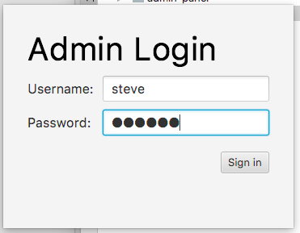
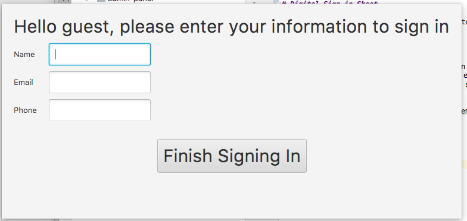
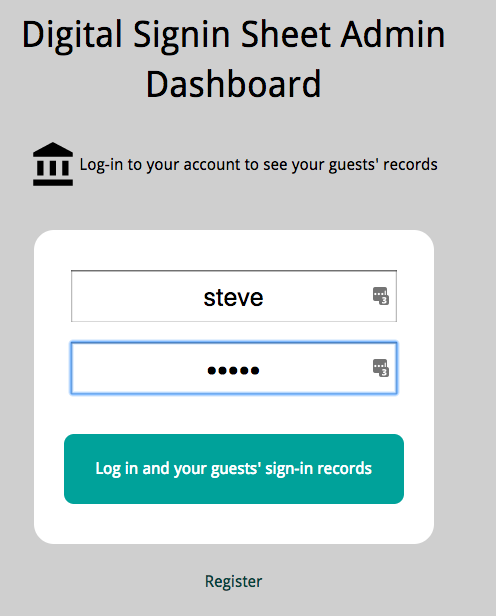
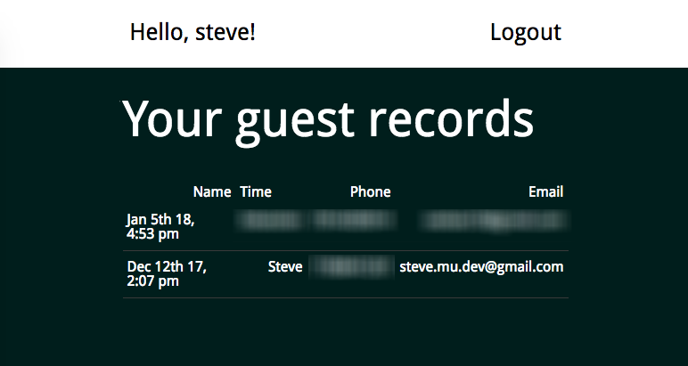
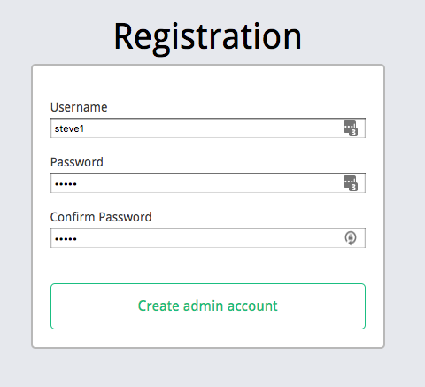

# Digital Sign-in Sheet

A signin sheet application for getting visitors' information at an event.

This software have two part:

1. A Java FX client application that runs on a computer for getting visitors' name, phone information etc.
2. A admin panel website for seeing visitor signin records. Made with React/Redux/Node.js.

The admin is deployed at https://sheet.stevemu.com

## Screen shots

### The client application:

### Admin panel

